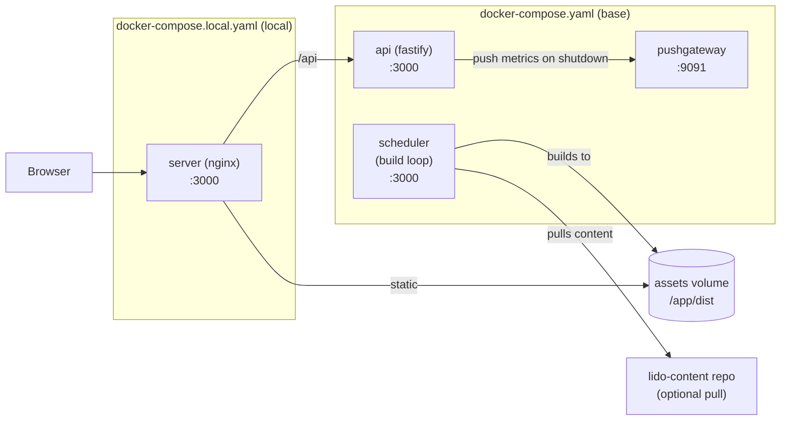

# App Architecture (Docker-Compose First)

This document describes how the app is wired together starting from `docker-compose.yaml`, and abstracts the structure so it can be reused for a similar app.

## 1) Docker Compose Topology

### `docker-compose.yaml` (base)

Services and their roles:

- **scheduler**: builds the static site on a schedule and exposes health/metrics.
- **api**: Fastify API for CSP reporting, Matomo event proxying, health, and metrics.
- **pushgateway**: Prometheus Pushgateway for metrics ingestion.

Volumes:

- **assets**: shared volume used to store build artifacts (`/app/dist`) produced by the scheduler.

### `docker-compose.local.yaml` (local add-on)

Adds a static server in front of the built assets:

- **server**: Nginx container serving `/app/dist/current` and proxying `/api` to the `api` container.

## 2) Container Responsibilities

### scheduler

Entrypoint: `infra/scheduler/entrypoint.sh` → `infra/scheduler/index.ts`

Responsibilities:

- Periodically **pulls content** from `lidofinance/lido-content` (via `infra/scheduler/pull_content.sh`) when `CLONE_CONTENT_REPO=True`.
- Runs `yarn build`, which does `next build` + `build-sitemap.mjs`.
- Writes build output to `dist/tmp`, then rotates into `dist/<timestamp>` and symlinks `dist/current`.
- Keeps the last 12 builds; removes older ones.
- Exposes:
  - `GET /health`
  - `GET /metrics`
- Publishes build metrics to Prometheus (via `prom-client`).

Ports:

- The scheduler listens on **container port 3000**. Compose currently maps `127.0.0.1:3001:3001` in `docker-compose.yaml` (no host access to the 3000 listener unless updated).

### api

Entrypoint: `infra/api/entrypoint.sh` → `infra/api/index.ts`

Responsibilities:

- **CSP report endpoint**: `POST /api/csp`
- **Matomo events endpoint**: `POST /api/matomo-events`
- **Health**: `GET /health` and `GET /api/health`
- **Metrics**: `GET /api/metrics`
- **Rate limiting** using `privateEnv.RATE_LIMIT` and `privateEnv.RATE_LIMIT_TIME_FRAME`
- Tracks request latency and status codes for metrics.
- On shutdown, pushes metrics to Pushgateway if `PUSHGATEWAY` is set.

Ports:

- Listens on **container port 3000**. Not published to host by default in `docker-compose.yaml`.

### pushgateway

Standard Prometheus Pushgateway (`prom/pushgateway:v1.8.0`) on port 9091.

### server (local only)

Nginx container serving the static output and proxying API:

- Serves `/app/dist/current`
- Proxies `/api` → `http://api:3000`
- Adds security and caching headers from env vars.
- Handles redirects for various legacy routes.

## 3) Build + Deploy Flow

High-level flow:

1. **scheduler** pulls content (optional, controlled by env).
2. **scheduler** runs `yarn build` (Next.js build + sitemap).
3. Build output goes to `dist/tmp`, then is moved to `dist/<timestamp>`.
4. `dist/current` is updated to point at the latest build.
5. **server** (local) serves `dist/current` and proxies `/api` to **api**.

Artifacts:

- `dist/current`: active static site build.
- `dist/<timestamp>`: rotated historical builds.
- `assets` volume: shared build output between scheduler and server.

## 4) Runtime Request Flow (local)

```
Browser
  └─> Nginx (server)
       ├─> Static assets from /app/dist/current
       └─> /api/* proxied to api:3000
              ├─> /api/csp
              ├─> /api/matomo-events
              ├─> /api/metrics
              └─> /api/health
```

### Diagram (Mermaid)



## 5) Observability

- **scheduler** exposes `/metrics` for build-related metrics.
- **api** exposes `/api/metrics` for request and Matomo event metrics.
- Both use `prom-client` and include startup metadata from `build-info.json`.
- **api** can push metrics to Pushgateway at shutdown using `PUSHGATEWAY` env.

## 6) Reusable Architecture Pattern

Use this template for a similar app:

1. **Scheduler service**

   - Scheduled build loop (cron) that:
     - Pulls content/config (optional).
     - Runs build to `dist/tmp`.
     - Rotates into `dist/<timestamp>` and symlinks `dist/current`.
   - Expose `/health` and `/metrics`.

2. **API service**

   - Small Fastify (or similar) service.
   - Handles:
     - health/metrics
     - CSP reporting
     - event ingestion proxy (analytics)
   - Supports rate limiting and Pushgateway integration.

3. **Static server**

   - Serves `dist/current`.
   - Proxies `/api` to the API service.
   - Injects security headers and cache controls via env.

4. **Shared volume**

   - Named volume (e.g., `assets`) to persist build artifacts between scheduler and server.

5. **Metrics**
   - Expose `/metrics` on services.
   - (Optional) Push to Pushgateway on shutdown.

## 7) Files to Reference When Reusing

- `docker-compose.yaml`
- `docker-compose.local.yaml`
- `Dockerfile`
- `infra/scheduler/index.ts`
- `infra/scheduler/pull_content.sh`
- `infra/api/index.ts`
- `infra/server/default.conf.template`
